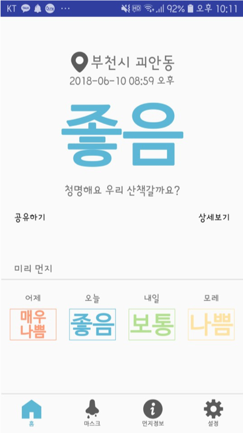
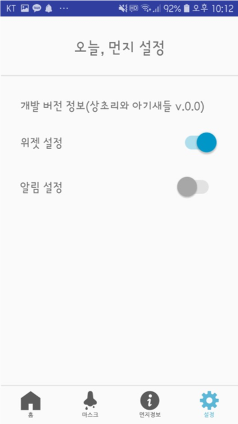

## <오늘, 먼지> Android Front
### 2019년 캡스톤 디자인 창의적미디어설계프로젝트
미세먼지 정보와 실시간 지역별 미세먼지 정보 확인 가능한 어플리케이션

#### 상초리와 아기새들 팀원
- 이상철, 김소연, 김혜린, 유정인

#### 프론트 개발
- 개발 환경: 안드로이드 스튜디오
- 개발 언어: JAVA
- 기획 및 개발기간: 2018년 1학기 중 약 한 달

#### 프로젝트 내 담당역할
- 안드로이드 어플리케이션 프론트 전체 개발

#### PREVIEW

    
